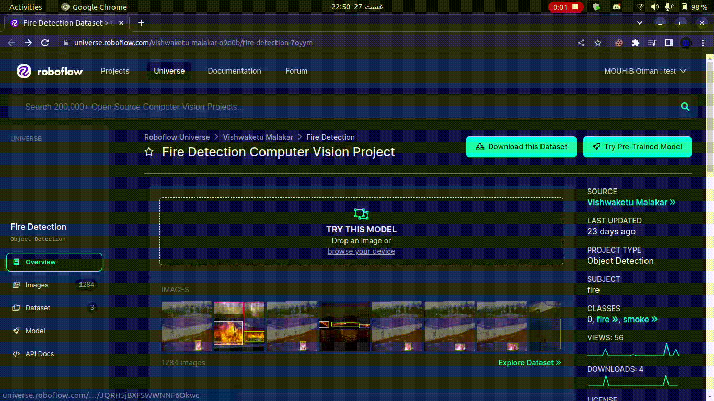
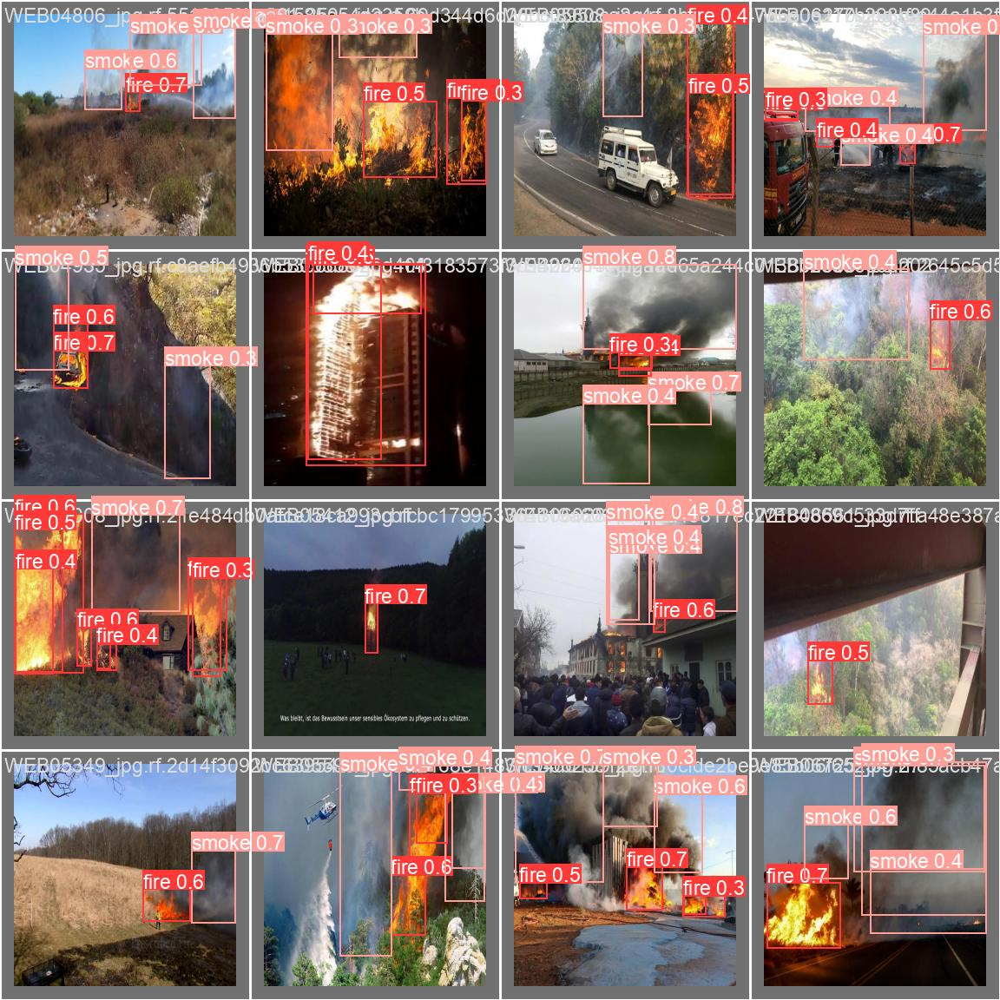
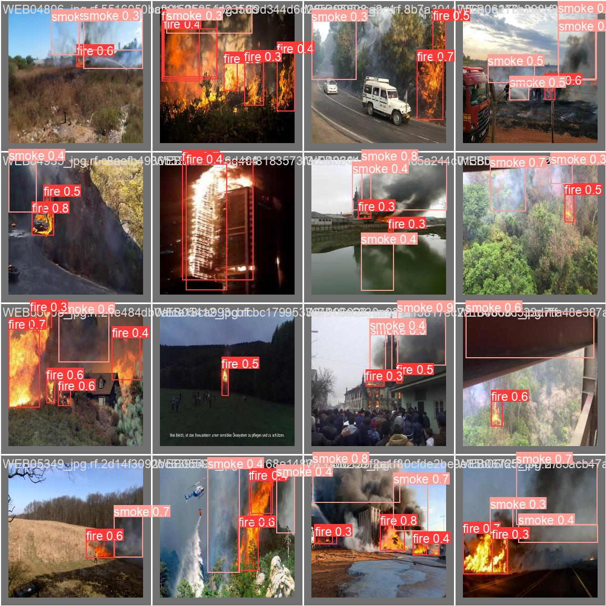
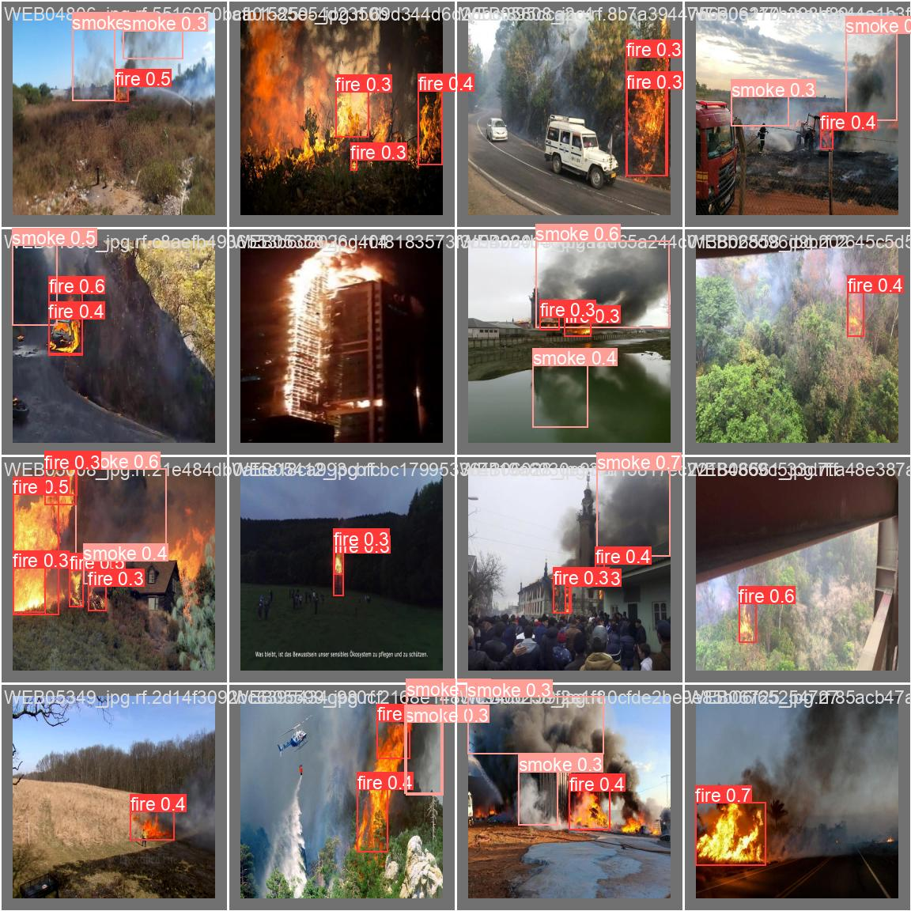

# <h1 style="font-size:40px; text-align:center;"> AI-ATAR
<h6 style="font-size:40px; text-align:center;"> Real-Time Forest Fire Detection

## <h2 style="font-size:30px; ">Introduction</h2>

<p style="font-size:20px; ">The Real-Time Forest Fire Detection project employs cutting-edge deep learning techniques to detect and respond to forest fires promptly. Leveraging YOLO (You Only Look Once) models and efficient object detection algorithms, this project aims to contribute to early fire detection, reducing the risk of catastrophic damage to our natural landscapes.

## <h2 style="font-size:30px; ">Project in Action</h2>
   
<br>This GIF demonstrates how the fire detection system detects fire in a real-time video stream.

## <h2 style="font-size:30px; ">Features

- **Video-Based Detection**: Detect fires in real-time from video streams, enabling swift intervention.
- **Efficient Algorithms**: Utilize YOLO models for accurate and rapid fire detection.
- **Customization**: Easily adapt the models and configurations to suit specific detection requirements.
- **Live Streaming**: Enable live fire detection from webcams or video sources for immediate monitoring.
# YOLOv8 Model Training using the `python -m App` Command

Welcome to the guide on how to train a YOLOv8 model using the `python -m App` command. YOLOv8 is a popular object detection algorithm known for its speed and accuracy. This guide will walk you through the steps required to train your own YOLOv8 model using the provided Python script.

## Prerequisites

Before you begin, make sure you have the following prerequisites installed:

- Python (>= 3.6)
- PyTorch (>= 1.7)
- CUDA (for GPU training, recommended)
- OpenCV
- Requirements specified in `requirements.txt` (provided with the repository)


## <h2 style="font-size:30px; "> Table of Contents

- [Installation](#Installation)
- [Configuration](#configuration)
- [Usage](#usage)
  - [Usage1](#usage1)
    - [App.py](#usage1)
  - [Usage2](#usage1)
    - [Download dataset using roboflow](#usage1)
    - [Train a model](#usage1)
    - [Resume incomplete Train](#usage1)
    - [Validate Trained model](#usage1)
    - [Test model on local video Sample](#usage1)
    - [Test model on live stream](#usage1)
- [Datasets](#datasets)
- [Models](#models)
- [Example](#examples)
  - [Dataset](#Dataset)
      - https://universe.roboflow.com/vishwaketu-malakar-o9d0b/fire-detection-7oyym/dataset/6#
  - [Train](#Train)
  - [Resume Train](#resume train)
  - [Validate](#Validate)
  - [Performance metrix evaluation](#performance metrics evaluation)
  - [Test on local video sample](#Test on local video sample)
  - [Test Real Time](#test real time)
- [Contributing](#contributing)
- [License](#license)
- [Contact](#contact)
- [Acknowledgements](#acknowledgements)

# <h2 style="font-size:30px; "> Installation
## Important Note: GPU Compatibility and TensorFlow-GPU Installation

>If you intend to use this project with GPU acceleration for deep learning tasks, it's crucial to ensure that you have the correct NVIDIA and CUDA drivers installed that are compatible with your GPU. Additionally, make sure you have a compatible version of TensorFlow-GPU.

>To check the compatibility of your GPU with the required drivers and TensorFlow-GPU version, as well as for detailed installation instructions, please refer to the official TensorFlow documentation: [TensorFlow GPU Installation Guide](https://www.tensorflow.org/install/source)

>Having the appropriate GPU drivers and TensorFlow-GPU version will ensure optimal performance and compatibility when running deep learning tasks on your system.

>Please note that GPU support requires proper setup and compatibility, and it's recommended to follow the official installation guide provided by TensorFlow for a smooth experience.

1. Clone this repository:
   ```sh
   user@ubuntu:~$  git clone https://github.com/MAZICM/AI-ATAR.git
   ```
2. Access the Repo:
   ```sh
   user@ubuntu:~$ cd AI-ATAR/
   ```
3. Create your Python env :
   ```sh
   user@ubuntu:~/AI-ATAR$ python3 -m venv venv
   ```
4. Activate your python env:
   ```sh
   (venv) user@ubuntu:~/AI-ATAR$ source  venv/bin/activate
   ```
5. Install the required dependencies:
   ```sh
   (venv) user@ubuntu:~/AI-ATAR$ pip install -r requirements.txt
   ```
## <h2 style="font-size:30px; ">Configuration
>Configuring and adapting the fire and smoke detection to your specific requirements is straightforward. Simply follow these steps:

1. **Setup Environment:**
   >Ensure you have all necessary dependencies installed, including Python, required libraries, and any pretrained models you plan to use. Refer to the project's documentation for installation instructions.

2. **Prepare Data:**
   >If you're using custom data, make sure your images are properly formatted and organized. For instance, put your test images in a designated directory.

3. **Run the Script:**
   >Execute the provided Python script, and it will prompt you for the necessary input:
   ```sh
   python -m App
   ```
   
   >The script will guide you through the process, requesting paths to images, model checkpoints, and optional parameters like threshold values or epochs based on the action you want to perform based on your choice from the displayed menu.

4. **Adapt Parameters:**

   >Modify the parameters within the script to tailor the detection to your specific needs. The prompts will guide you to input values such as threshold for confidence scores, number of epochs, and more.

   >Remember that this project is open-source and under the MIT license. Feel free to experiment by hard coding values directly in the script if you're curious about how changes impact detection performance. The entire process is designed to be intuitive, and you have the flexibility to explore and modify parameters for experimentation.

5. **Review Results:**

   >The script will generate detection results based on your provided inputs. It will display the detected classes, confidence scores and many more useful information.

6. **Fine-Tune as Needed:**
   >Depending on the results and your specific use case, you can adjust the parameters further and re-run the script to refine the detection.
   >The entire process is designed to be intuitive and user-friendly. You don't need to edit complex configuration files. Instead, you'll be guided step-by-step through the script's prompts to insert the correct paths, file names, and other values. This flexibility allows you to adapt the detection to various scenarios and achieve accurate results effortlessly.

## <h2 style="font-size:30px; "> Usage

### 1. Using App.py file :

Run the `App.py` file to access all the utilities .

```sh
(venv) user@ubuntu:~/AI-ATAR$ python -m App
```

OUTPUT

```sh
(venv) user@ubuntu:~/AI-ATAR$ python -m App


Welcome To ATAR ! :)
2023-08-25 23:30:09,558 - INFO


    -----------------------
    Welcome to My CLI Menu
    -----------------------

            1. Download RoboFlow straining dataset
            2. Train
            3. Resume existing Train
            4. Valid
            5. Live Test
            6. test on an existing file
            7. Quit

    ----------------------------------------------------------
    To exit the CLI menu, choose option '7' or press 'Ctrl+C'.
    ------------------------------------------------------------

Execution time: 0.00 seconds
2023-08-25 23:30:09,559 - INFO


      ======> Enter your choice : 
```

### 2. Using Each utility on it s own :

### Video Detection

Run the `videoDetect()` function to detect fires in a video file.

```sh
(venv) user@ubuntu:~/AI-ATAR$ python -c 'from src.Utilities.vDetect import video_detect; video_detect()'
```

OUTPUT

```sh
(venv) user@ubuntu:~/AI-ATAR$ python -c 'from src.Utilities.vDetect import video_detect; video_detect()'


            1. video1.mp4

      ======> Enter the number of your choice: 

```

### Live Stream Detection

Run the `Stream()` function to start a live stream for fire detection.

```sh
python -c 'from src.Utilities.sDetect import stream; stream()'
```

OUTPUT

```sh
(venv) user@ubuntu:~/AI-ATAR$ python -c 'from src.Utilities.sDetect import stream; stream()'

STREAM START
2023-08-25 23:53:12,919 - INFO

      ======> source :
```

### Model Training

Run the `train()` function to train your own YOLO model.

```sh
python -c 'from src.Utilities.modelTrain import m_train; m_train()'
```

OUTPUT

```sh

(venv) user@ubuntu:~/AI-ATAR$  python -c 'from src.Utilities.modelTrain import m_train; m_train()'


            1. yolov8n.pt
            2. yolov8s.pt
            3. yolov8m.pt
            4. yolov8l.pt
            5. yolov8x.pt

      ======> Enter the number of your choice: 
```

### Validation

Run the `valid()` function to validate your YOLO model.

```sh
python -c 'from src.Utilities.modelValid import m_valid; m_valid()'
```

OUTPUT

```sh
(venv) user@ubuntu:~/AI-ATAR$ python -c 'from src.Utilities.modelValid import m_valid; m_valid()'


            1. train-e100-i256-w8-v8s
            2. train-e300-i240-w8-v8s
            3. train-e100-i256-w8-v8n
            4. train-e300-i256-w8-v8n
            5. train-e50-i256-w8-v8n
            6. train-e50-i256-w8-v8s

      ======> Enter the number of your choice: 
```
## <h2 style="font-size:30px; ">Example
## [Dataset](#Dataset)
Roboflow, your premier data annotation and dataset resource, 
simplifies the annotation process for your images and videos 
while also offering a repository of high-quality, pre-existing 
datasets for your convenience. <br>Seamlessly enhance your machine 
learning projects with accurately labeled data or 
access to curated datasets.

## Why Roboflow?

- **Efficient Annotation:** Annotate images and videos quickly with intuitive tools.
- **Diverse Annotations:** Support for object detection, segmentation, and more.
- **High-Quality Datasets:** Explore and download datasets for various applications.
- **Community:** Join a collaborative community of ML enthusiasts.

## Getting Started

1. **Sign Up:** Create an account at [Roboflow](https://roboflow.com/signup).
2. **Annotate:** Label your data using Roboflow tools.
3. **Download:** Find and use datasets for your projects.
4. **Connect:** Engage with the community and share insights.
## Recommended Fire Detection Dataset
Check out the curated "Fire Detection" dataset by vishwaketu-malakar-o9d0b:

> We have used this dataset for the testing of this tool 
> we will be evaluating the performance later on together on some models trained under this dataset
- [Fire Detection Dataset](https://universe.roboflow.com/vishwaketu-malakar-o9d0b/fire-detection-7oyym/dataset/6#)
> follow this preview in order to download your dataset : 
>- either dowload as zip and extract and put on the directory "src/datasets/" and move directly to the training process
>- or get the strings provided in the download code and insert them respectively like this 


EXAMPLE RUN

```sh
    (venv) user@ubuntu:~/MAZICM/AI-ATAR$ python -m App
    
    
    Welcome To ATAR ! :)
    2023-09-08 02:40:10,571 - INFO
    
    
            -----------------------
            Welcome to My CLI Menu
            -----------------------
    
                    1. Download RoboFlow straining dataset
                    2. Train
                    3. Resume existing Train
                    4. Valid
                    5. Live Test
                    6. test on an existing file
                    7. Quit
    
            ----------------------------------------------------------
            To exit the CLI menu, choose option '7' or press 'Ctrl+C'.
            ------------------------------------------------------------
    
    Execution time: 0.00 seconds
    2023-09-08 02:40:10,573 - INFO
    
    
    
    
              ======> Enter your choice : 1
    Downloading DataSet ...............................
    Enter your API_key : xxxxxxxxxxxxxxxxxxxxxxxxxxxxxxxxxxx
    Enter your workspace : xxxxxxxxxxxxxxx                 
    Enter your project : xxxxxxxxxxxx
    Enter your Download :yolov8x
    
    DOWNLOAD START
    2023-09-08 02:40:38,012 - INFO
    
    
    loading Roboflow workspace...
    loading Roboflow project...

     
```

## [Train](#Train)

   Run the training script using the following command and insert you Training configuration :
   ```bash
   (venv) user@ubuntu:~/AI-Yolo$ python -m App 

Welcome To ATAR ! :)
2023-09-08 03:25:23,736 - INFO


        -----------------------
        Welcome to My CLI Menu
        -----------------------

                1. Download RoboFlow straining dataset
                2. Train
                3. Resume existing Train
                4. Valid
                5. Live Test
                6. test on an existing file
                7. Quit

        ----------------------------------------------------------
        To exit the CLI menu, choose option '7' or press 'Ctrl+C'.
        ------------------------------------------------------------

Execution time: 0.00 seconds
2023-09-08 03:25:23,737 - INFO


          ======> Enter your choice : 2

         DEFAULT MODELS :


                1. yolov8n.pt
                2. yolov8s.pt
                3. yolov8m.pt
                4. yolov8l.pt
                5. yolov8x.pt

          ======> Enter the number of your choice: 1

         DATASETS :


                1. txt.txt
                2. Fire-Detection-6

          ======> Enter the number of your choice: 2

         Configure Training Parameters : 

          ======> Insert Epochs Value   : 50

          ======> Insert imgsz Value    : 256

          ======> Insert device Value   : 0

          ======> Insert workers Value  : 8
Downloading https://github.com/ultralytics/assets/releases/download/v0.0.0/yolov8n.pt to '/home/kenaro/MAZICM/AI-ATAR/src/yolov8DefaultModels/yolov8n.pt'...
100%|█████████████████████████████████████████████████████████████████████████████████████████████████████████████████████████████████████████████████████████████████████████████████████████| 6.23M/6.23M [00:03<00:00, 2.17MB/s]

Training START
2023-09-08 03:26:26,496 - INFO


Ultralytics YOLOv8.0.173 🚀 Python-3.11.4 torch-2.0.1+cu117 CUDA:0 (NVIDIA GeForce 930MX, 2003MiB)
engine/trainer: task=detect, mode=train, model=/home/kenaro/MAZICM/AI-ATAR/src/yolov8DefaultModels/yolov8n.pt, data=/home/kenaro/MAZICM/AI-ATAR/src/datasets/Fire-Detection-6/data.yaml, 
epochs=50, patience=50, batch=16, imgsz=256, save=True, save_period=-1, cache=False, device=0, 
workers=8, project=Train, name=train-e50-i256-w8-v8n, exist_ok=False, pretrained=True, 
optimizer=auto, verbose=True, seed=0, deterministic=True, single_cls=False, rect=False, 
cos_lr=False, close_mosaic=10, resume=False, amp=True, fraction=1.0, profile=False, freeze=None, 
overlap_mask=True, mask_ratio=4, dropout=0.0, val=True, split=val, save_json=False, 
save_hybrid=False, conf=None, iou=0.7, max_det=300, half=False, dnn=False, plots=True, 
source=None, show=False, save_txt=False, save_conf=False, save_crop=False, show_labels=True, 
show_conf=True, vid_stride=1, stream_buffer=False, line_width=None, visualize=False, 
augment=False, agnostic_nms=False, classes=None, retina_masks=False, boxes=True, format=torchscript, 
keras=False, optimize=False, int8=False, dynamic=False, simplify=False, opset=None, workspace=4, 
nms=False, lr0=0.1, lrf=0.01, momentum=0.937, weight_decay=0.0005, warmup_epochs=3.0, 
warmup_momentum=0.8, warmup_bias_lr=0.1, box=7.5, cls=0.5, dfl=1.5, pose=12.0, kobj=1.0, 
label_smoothing=0.0, nbs=64, hsv_h=0.015, hsv_s=0.7, hsv_v=0.4, degrees=0.0, translate=0.1, 
scale=0.5, shear=0.0, perspective=0.0, flipud=0.0, fliplr=0.5, mosaic=1.0, mixup=0.0, 
copy_paste=0.0, cfg=None, tracker=botsort.yaml, save_dir=Train/train-e50-i256-w8-v8n2
   ```

> Congratulations! You've successfully trained a YOLOv8 model using the `python -m App` command. Experiment with
> different configurations, datasets, and hyperparameters to achieve the best results for your specific object detection
> task.

> If you encounter any issues or need further assistance, refer to the repository's documentation or seek help from the
> community.
<br> For our example we will be using the models yolov8n.pt , yolov8s.pt, yolov8m.pt
> and we ll be tranning each model 3 times (50 epochs, 100 epochs, 300 epochs)
> with other fixed configuration (workers 8, 256 imgsz)
> and don't forget to mention if you are using 'CPU' put ur GPU device id in device value <br>
<br>Happy training! 🚀

## [Resume Train](#resume train)

If your training ever crashed you can use this functionality to resume the training

````shell
    Welcome To ATAR ! :)
2023-09-08 04:39:29,558 - INFO


        -----------------------
        Welcome to My CLI Menu
        -----------------------

                1. Download RoboFlow straining dataset
                2. Train
                3. Resume existing Train
                4. Valid
                5. Live Test
                6. test on an existing file
                7. Quit

        ----------------------------------------------------------
        To exit the CLI menu, choose option '7' or press 'Ctrl+C'.
        ------------------------------------------------------------

Execution time: 0.00 seconds
2023-09-08 04:39:29,559 - INFO


          ======> Enter your choice : 3
RT..............


                1. train-e50-i256-w8-v8m
                2. train-e300-i256-w8-v8m
                3. train-e100-i256-w8-v8m
                4. train-e50-i256-w8-v8n2
                5. train-e100-i256-w8-v8s
                6. train-e300-i240-w8-v8s
                7. train-e300-i256-w8-v8s
                8. train-e100-i256-w8-v8n
                9. train-e300-i256-w8-v8n
                10. train-e50-i256-w8-v8n
                11. train-e4-i256-w8-v8l2
                12. train-e6-i256-w16-v8l
                13. train-e50-i256-w8-v8s
                14. train-e6-i256-w8-v8l
                15. train-e6-i156-w4-v8l
                16. train-e4-i256-w8-v8l

          ======> Enter the number of your choice: 15

Training START
2023-09-08 04:39:36,772 - INFO


Ultralytics YOLOv8.0.173 🚀 Python-3.11.4 torch-2.0.1+cu117 CUDA:0 (NVIDIA GeForce 930MX, 2003MiB)
engine/trainer: task=detect, mode=train, model=/home/kenaro/MAZICM/AI-ATAR/Train/train-e6-i156-w4-v8l/weights/last.pt, data=/home/kenaro/MAZICM/AI-ATAR/src/datasets/Fire-Detection-6/data.yaml, epochs=6, patience=50, batch=16, imgsz=160, save=True, save_period=-1, cache=False, device=0, workers=4, project=Train, name=train-e6-i156-w4-v8l, exist_ok=False, pretrained=True, optimizer=auto, verbose=True, seed=0, deterministic=True, single_cls=False, rect=False, cos_lr=False, close_mosaic=10, resume=False, amp=True, fraction=1.0, profile=False, freeze=None, overlap_mask=True, mask_ratio=4, dropout=0.0, val=True, split=val, save_json=False, save_hybrid=False, conf=None, iou=0.7, max_det=300, half=False, dnn=False, plots=True, source=None, show=False, save_txt=False, save_conf=False, save_crop=False, show_labels=True, show_conf=True, vid_stride=1, stream_buffer=False, line_width=None, visualize=False, augment=False, agnostic_nms=False, classes=None, retina_masks=False, boxes=True, format=torchscript, keras=False, optimize=False, int8=False, dynamic=False, simplify=False, opset=None, workspace=4, nms=False, lr0=0.1, lrf=0.01, momentum=0.937, weight_decay=0.0005, warmup_epochs=3.0, warmup_momentum=0.8, warmup_bias_lr=0.0, box=7.5, cls=0.5, dfl=1.5, pose=12.0, kobj=1.0, label_smoothing=0.0, nbs=64, hsv_h=0.015, hsv_s=0.7, hsv_v=0.4, degrees=0.0, translate=0.1, scale=0.5, shear=0.0, perspective=0.0, flipud=0.0, fliplr=0.5, mosaic=1.0, mixup=0.0, copy_paste=0.0, cfg=None, tracker=botsort.yaml, save_dir=Train/train-e6-i156-w4-v8l

                   from  n    params  module                                       arguments                     
  0                  -1  1      1856  ultralytics.nn.modules.conv.Conv             [3, 64, 3, 2]                 
  1                  -1  1     73984  ultralytics.nn.modules.conv.Conv             [64, 128, 3, 2]               
  2                  -1  3    279808  ultralytics.nn.modules.block.C2f             [128, 128, 3, True]           
  3                  -1  1    295424  ultralytics.nn.modules.conv.Conv             [128, 256, 3, 2]              
  4                  -1  6   2101248  ultralytics.nn.modules.block.C2f             [256, 256, 6, True]           
  5                  -1  1   1180672  ultralytics.nn.modules.conv.Conv             [256, 512, 3, 2]              
  6                  -1  6   8396800  ultralytics.nn.modules.block.C2f             [512, 512, 6, True]           
  7                  -1  1   2360320  ultralytics.nn.modules.conv.Conv             [512, 512, 3, 2]              
  8                  -1  3   4461568  ultralytics.nn.modules.block.C2f             [512, 512, 3, True]           
  9                  -1  1    656896  ultralytics.nn.modules.block.SPPF            [512, 512, 5]                 
 10                  -1  1         0  torch.nn.modules.upsampling.Upsample         [None, 2, 'nearest']          
 11             [-1, 6]  1         0  ultralytics.nn.modules.conv.Concat           [1]                           
 12                  -1  3   4723712  ultralytics.nn.modules.block.C2f             [1024, 512, 3]                
 13                  -1  1         0  torch.nn.modules.upsampling.Upsample         [None, 2, 'nearest']          
 14             [-1, 4]  1         0  ultralytics.nn.modules.conv.Concat           [1]                           
 15                  -1  3   1247744  ultralytics.nn.modules.block.C2f             [768, 256, 3]                 
 16                  -1  1    590336  ultralytics.nn.modules.conv.Conv             [256, 256, 3, 2]              
 17            [-1, 12]  1         0  ultralytics.nn.modules.conv.Concat           [1]                           
 18                  -1  3   4592640  ultralytics.nn.modules.block.C2f             [768, 512, 3]                 
 19                  -1  1   2360320  ultralytics.nn.modules.conv.Conv             [512, 512, 3, 2]              
 20             [-1, 9]  1         0  ultralytics.nn.modules.conv.Concat           [1]                           
 21                  -1  3   4723712  ultralytics.nn.modules.block.C2f             [1024, 512, 3]                
 22        [15, 18, 21]  1   5584342  ultralytics.nn.modules.head.Detect           [2, [256, 512, 512]]          
Model summary: 365 layers, 43631382 parameters, 43631366 gradients

Transferred 595/595 items from pretrained weights
Freezing layer 'model.22.dfl.conv.weight'
AMP: running Automatic Mixed Precision (AMP) checks with YOLOv8n...
AMP: checks passed ✅
train: Scanning /home/kenaro/MAZICM/AI-ATAR/src/datasets/Fire-Detection-6/train/labels.cache... 2703 images, 0 backgrounds, 0 corrupt: 100%|██████████| 2703/2703 [00:00<
WARNING ⚠️ Box and segment counts should be equal, but got len(segments) = 313, len(boxes) = 11740. To resolve this only boxes will be used and all segments will be removed. To avoid this please supply either a detect or segment dataset, not a detect-segment mixed dataset.
val: Scanning /home/kenaro/MAZICM/AI-ATAR/src/datasets/Fire-Detection-6/valid/labels.cache... 203 images, 0 backgrounds, 0 corrupt: 100%|██████████| 203/203 [00:00<?, ?i
WARNING ⚠️ Box and segment counts should be equal, but got len(segments) = 12, len(boxes) = 909. To resolve this only boxes will be used and all segments will be removed. To avoid this please supply either a detect or segment dataset, not a detect-segment mixed dataset.
Plotting labels to Train/train-e6-i156-w4-v8l/labels.jpg... 
optimizer: AdamW(lr=0.001667, momentum=0.9) with parameter groups 97 weight(decay=0.0), 104 weight(decay=0.0005), 103 bias(decay=0.0)
Resuming training from /home/kenaro/MAZICM/AI-ATAR/Train/train-e6-i156-w4-v8l/weights/last.pt from epoch 4 to 6 total epochs
Closing dataloader mosaic
Image sizes 160 train, 160 val
Using 4 dataloader workers
Logging results to Train/train-e6-i156-w4-v8l
Starting training for 6 epochs...

      Epoch    GPU_mem   box_loss   cls_loss   dfl_loss  Instances       Size
        4/6      1.69G      2.145      1.726      1.688         87        160:  11%|█         | 19/169 [00:32<04:14,  1.70s/it]

````

> Congratulations! <br><br>You've successfully resumed a crashed trainning
> the training will contuinue on the same confuration setted first
> <br><br>Training rescued ! 🚀

## [Validate](#Validate)

````shell
Welcome To ATAR ! :)
2023-09-08 05:29:44,752 - INFO


        -----------------------
        Welcome to My CLI Menu
        -----------------------

                1. Download RoboFlow straining dataset
                2. Train
                3. Resume existing Train
                4. Valid
                5. Live Test
                6. test on an existing file
                7. Quit

        ----------------------------------------------------------
        To exit the CLI menu, choose option '7' or press 'Ctrl+C'.
        ------------------------------------------------------------

Execution time: 0.00 seconds
2023-09-08 05:29:44,753 - INFO


          ======> Enter your choice : 4

         Trained Model to Validate : 


                1. train-e50-i256-w8-v8m
                2. train-e300-i256-w8-v8m
                3. train-e100-i256-w8-v8m
                4. train-e100-i256-w8-v8s
                5. train-e300-i240-w8-v8s
                6. train-e300-i256-w8-v8s
                7. train-e100-i256-w8-v8n
                8. train-e300-i256-w8-v8n
                9. train-e50-i256-w8-v8n
                10. train-e50-i256-w8-v8s
                11. train-e6-i156-w4-v8l

          ======> Enter the number of your choice: 11

         Validate Best or Last Weights : 


                1. last.pt
                2. best.pt

          ======> Enter the number of your choice: 2

Validation START
2023-09-08 05:29:57,071 - INFO

Ultralytics YOLOv8.0.173 🚀 Python-3.11.4 torch-2.0.1+cu117 CUDA:0 (NVIDIA GeForce 930MX, 2003MiB)
Model summary (fused): 268 layers, 43608150 parameters, 0 gradients
val: Scanning /home/kenaro/MAZICM/AI-ATAR/src/datasets/Fire-Detection-6/valid/labels.cache... 203 images, 0 backgrounds, 0 corrupt: 100%|██████████| 203/203 [00:00<?, ?i
WARNING ⚠️ Box and segment counts should be equal, but got len(segments) = 12, len(boxes) = 909. To resolve this only boxes will be used and all segments will be removed. To avoid this please supply either a detect or segment dataset, not a detect-segment mixed dataset.
                 Class     Images  Instances      Box(P          R      mAP50  mAP50-95): 100%|██████████| 13/13 [00:20<00:00,  1.61s/it]
                   all        203        909      0.355      0.343      0.268        0.1
                  fire        203        571      0.417      0.399      0.332      0.124
                 smoke        203        338      0.294      0.287      0.204     0.0766
Speed: 0.5ms preprocess, 70.3ms inference, 0.0ms loss, 3.8ms postprocess per image
Results saved to Vaild/train-e6-i156-w4-v8l_eval_best

No errors occurred DONE SUCCESS
Execution time: 42.69 seconds
2023-09-08 05:30:39,764 - INFO

Validation EXIT

2023-09-08 05:30:39,765 - WARNING

          ======> Do you want to proceed? (Y/N): 
````

## [Performance metrix evaluation](#performance metrics evaluation)
### Yolov8n
<br>Train/train-e300-i256-w8-v8n/val_batch1_pred.jpg

### Yolov8s
<br>Train/train-e300-i256-w8-v8s/val_batch1_pred.jpg

### Yolov8m
<br>Train/train-e300-i256-w8-v8s/val_batch1_pred.jpg


## [Test on local video sample](#Test on local video sample)

````shell
Welcome To ATAR ! :)
2023-09-08 05:29:44,752 - INFO


        -----------------------
        Welcome to My CLI Menu
        -----------------------

                1. Download RoboFlow straining dataset
                2. Train
                3. Resume existing Train
                4. Valid
                5. Live Test
                6. test on an existing file
                7. Quit

        ----------------------------------------------------------
        To exit the CLI menu, choose option '7' or press 'Ctrl+C'.
        ------------------------------------------------------------

Execution time: 0.00 seconds
2023-09-08 05:29:44,753 - INFO


          ======> Enter your choice : 4

         Trained Model to Validate : 


                1. train-e50-i256-w8-v8m
                2. train-e300-i256-w8-v8m
                3. train-e100-i256-w8-v8m
                4. train-e100-i256-w8-v8s
                5. train-e300-i240-w8-v8s
                6. train-e300-i256-w8-v8s
                7. train-e100-i256-w8-v8n
                8. train-e300-i256-w8-v8n
                9. train-e50-i256-w8-v8n
                10. train-e50-i256-w8-v8s
                11. train-e6-i156-w4-v8l

          ======> Enter the number of your choice: 11

         Validate Best or Last Weights : 


                1. last.pt
                2. best.pt

          ======> Enter the number of your choice: 2

Validation START
2023-09-08 05:29:57,071 - INFO

Ultralytics YOLOv8.0.173 🚀 Python-3.11.4 torch-2.0.1+cu117 CUDA:0 (NVIDIA GeForce 930MX, 2003MiB)
Model summary (fused): 268 layers, 43608150 parameters, 0 gradients
val: Scanning /home/kenaro/MAZICM/AI-ATAR/src/datasets/Fire-Detection-6/valid/labels.cache... 203 images, 0 backgrounds, 0 corrupt: 100%|██████████| 203/203 [00:00<?, ?i
WARNING ⚠️ Box and segment counts should be equal, but got len(segments) = 12, len(boxes) = 909. To resolve this only boxes will be used and all segments will be removed. To avoid this please supply either a detect or segment dataset, not a detect-segment mixed dataset.
                 Class     Images  Instances      Box(P          R      mAP50  mAP50-95): 100%|██████████| 13/13 [00:20<00:00,  1.61s/it]
                   all        203        909      0.355      0.343      0.268        0.1
                  fire        203        571      0.417      0.399      0.332      0.124
                 smoke        203        338      0.294      0.287      0.204     0.0766
Speed: 0.5ms preprocess, 70.3ms inference, 0.0ms loss, 3.8ms postprocess per image
Results saved to Vaild/train-e6-i156-w4-v8l_eval_best

No errors occurred DONE SUCCESS
Execution time: 42.69 seconds
2023-09-08 05:30:39,764 - INFO

Validation EXIT

2023-09-08 05:30:39,765 - WARNING

          ======> Do you want to proceed? (Y/N): n

User chose not to proceed.
2023-09-08 05:35:24,321 - CRITICAL
(venv) (base) kenaro@rasmus:~/MAZICM/AI-ATAR$ clear
(venv) (base) kenaro@rasmus:~/MAZICM/AI-ATAR$ python -m App


Welcome To ATAR ! :)
2023-09-08 05:36:57,482 - INFO


        -----------------------
        Welcome to My CLI Menu
        -----------------------

                1. Download RoboFlow straining dataset
                2. Train
                3. Resume existing Train
                4. Valid
                5. Live Test
                6. test on an existing file
                7. Quit

        ----------------------------------------------------------
        To exit the CLI menu, choose option '7' or press 'Ctrl+C'.
        ------------------------------------------------------------

Execution time: 0.00 seconds
2023-09-08 05:36:57,482 - INFO


          ======> Enter your choice : 6
V..............


                1. video1.mp4

          ======> Enter the number of your choice: 1


                1. train-e50-i256-w8-v8m
                2. train-e300-i256-w8-v8m
                3. train-e100-i256-w8-v8m
                4. train-e100-i256-w8-v8s
                5. train-e300-i240-w8-v8s
                6. train-e300-i256-w8-v8s
                7. train-e100-i256-w8-v8n
                8. train-e300-i256-w8-v8n
                9. train-e50-i256-w8-v8n
                10. train-e50-i256-w8-v8s
                11. train-e6-i156-w4-v8l

          ======> Enter the number of your choice: 11


                1. last.pt
                2. best.pt

          ======> Enter the number of your choice: 2
enter threshold :0.5

Detection START
2023-09-08 05:38:08,200 - INFO
OpenCV: FFMPEG: tag 0x5634504d/'MP4V' is not supported with codec id 12 and format 'mp4 / MP4 (MPEG-4 Part 14)'
OpenCV: FFMPEG: fallback to use tag 0x7634706d/'mp4v'

0: 96x160 2 fires, 88.6ms
Speed: 7.6ms preprocess, 88.6ms inference, 8.4ms postprocess per image at shape (1, 3, 96, 160)

0: 96x160 2 fires, 60.3ms
Speed: 1.4ms preprocess, 60.3ms inference, 5.9ms postprocess per image at shape (1, 3, 96, 160)
````

````shell
0: 96x160 1 fire, 67.4ms
Speed: 2.0ms preprocess, 67.4ms inference, 7.4ms postprocess per image at shape (1, 3, 96, 160)

0: 96x160 1 fire, 70.2ms
Speed: 1.8ms preprocess, 70.2ms inference, 5.7ms postprocess per image at shape (1, 3, 96, 160)

0: 96x160 1 fire, 70.1ms
Speed: 2.5ms preprocess, 70.1ms inference, 7.8ms postprocess per image at shape (1, 3, 96, 160)


No errors occurred DONE SUCESS
Execution time: 72.33 seconds
2023-09-08 05:39:20,528 - INFO

Detection EXIT

2023-09-08 05:39:20,529 - WARNING

          ======> Do you want to proceed? (Y/N): 

````

## [Test Real Time](#test real time) !!
test the trained models on live stream and access the saved results 

## Contributing

>Contributions are welcome! Fork the repository, create a new branch, and submit a pull request.

## License
This project is licensed under the [MIT License](LICENSE).

## Contact
For questions or feedback, feel free to reach out to [MOUHIB Otman](mailto:mouhib.otm@gmail.com) or [BACCARI Rihab](mailto:)
## Acknowledgements
- Ultralytics for YOLO wrapper
- Roboflow for dataset

## User Reviews
> "I've been using this forest fire detection system for a while now, and it has significantly improved our response time to potential fire outbreaks. The accuracy and real-time detection capabilities are impressive." (Review Example)
> — John Doe, Forest Ranger (Reviewer name , username Example)

 